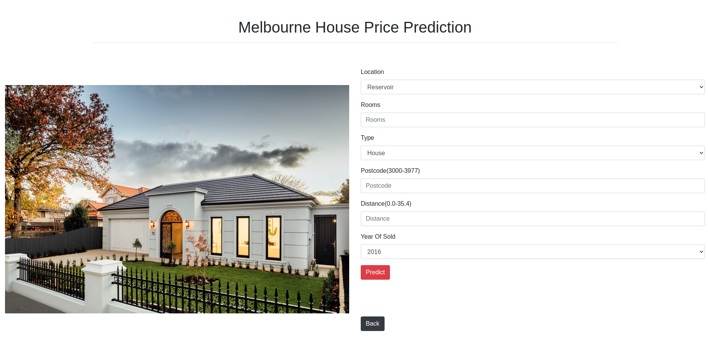
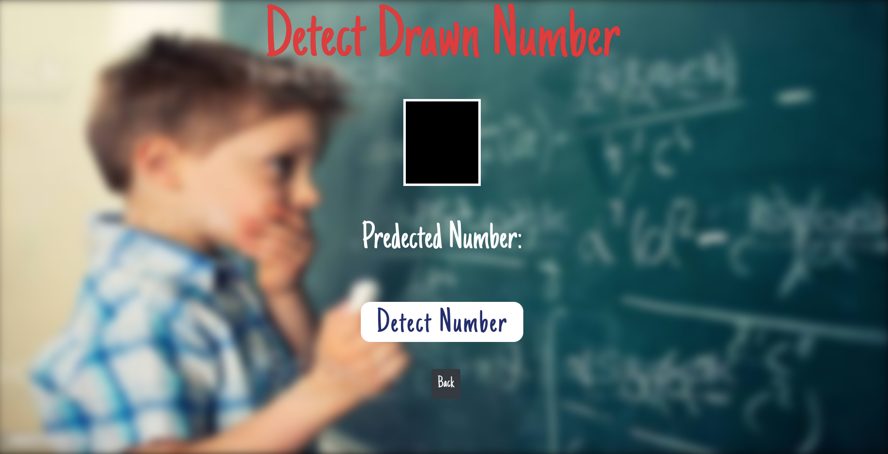
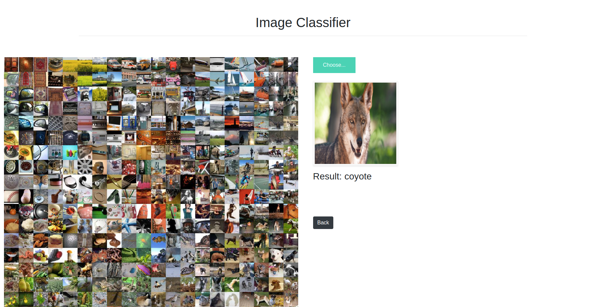
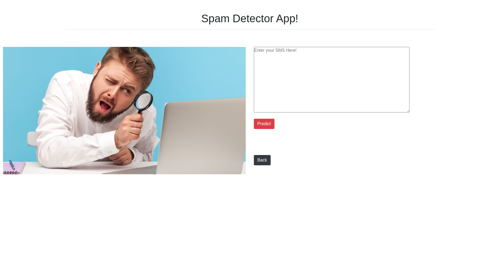
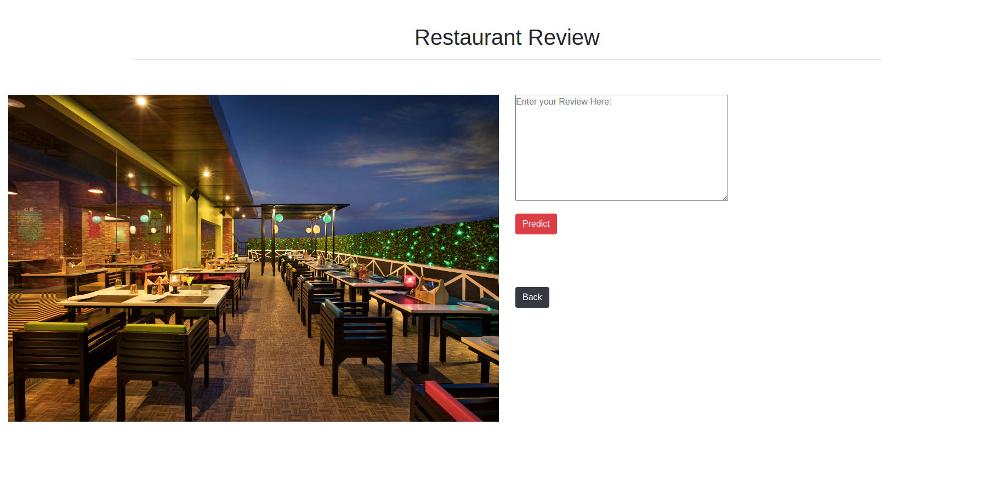

<h1 align='center'>Search.Ai</h1>

# Hi guys 👋, This project consist of different AI projects, using Machine Learning and Deep Learning (Supervised, Unsupervised, Computer Vision and NLP). First of all, I trained Machine Learning and Deep Learning models. After that I deploy them using Flask.

## **Applications**

### **Supervised**

- House Price 

   

### **Unsupervised**

   

### **Computer Vision**

- Number Detector 
   
- Image Classifier 

   

### **NLP**

- Spam Detector 
   
- Restaurant Review 

   

## Installation

- Visual Studio, Atom, PyCharm, Jupyter Notebook
- Python
- Flask
- Numpy
- Pandas
- Matplotlib
- Seaborn
- Sklearn
- Xgboos
- Joblib
- Pickle
- Tensorflow
- TFJS
- NLTK
- cv2

<h1 align='center'>Not completed yet!</h1>
