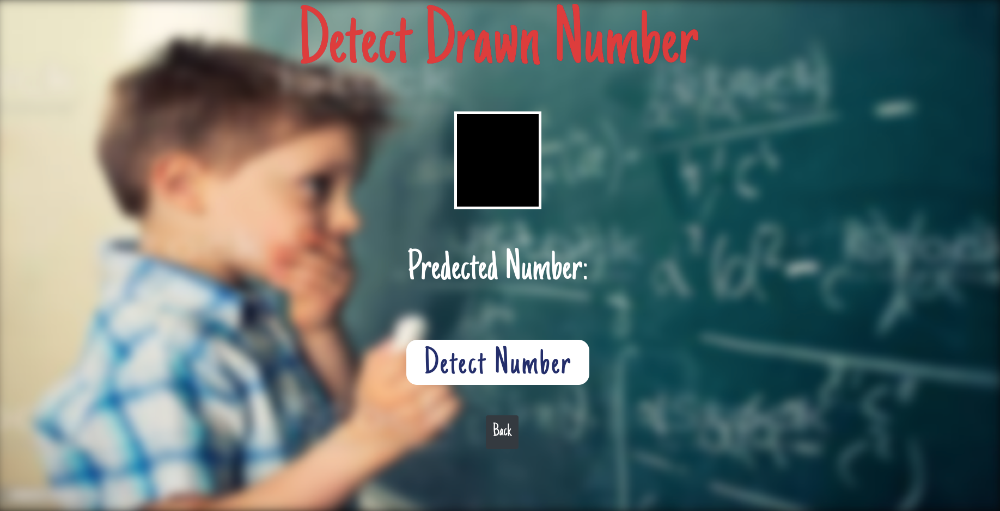
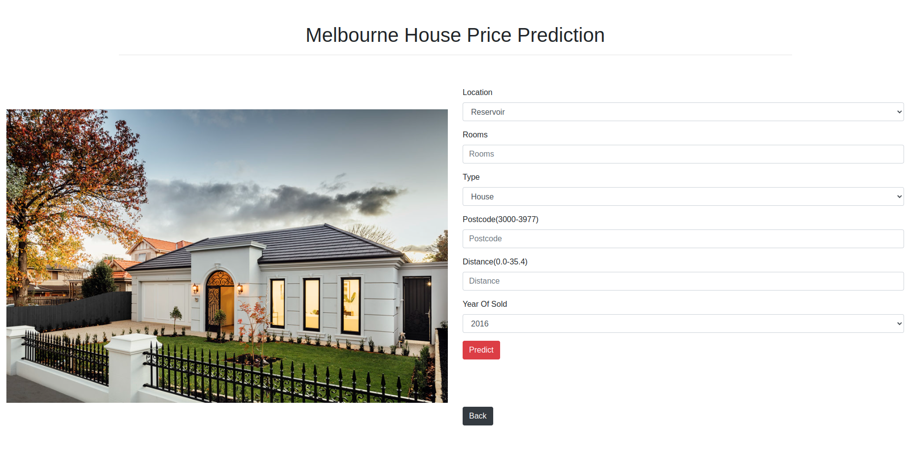
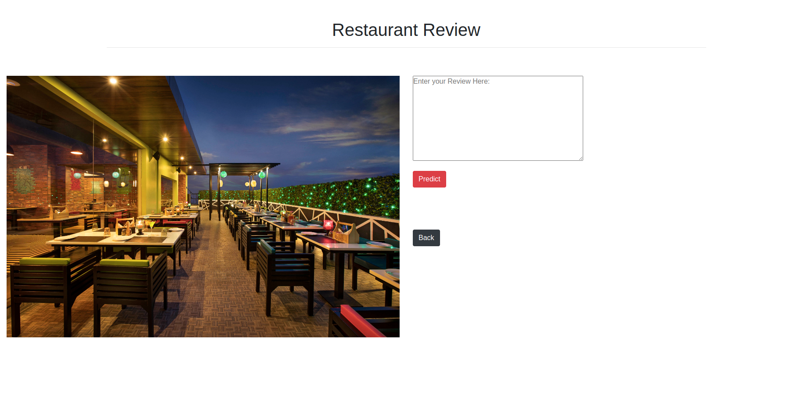
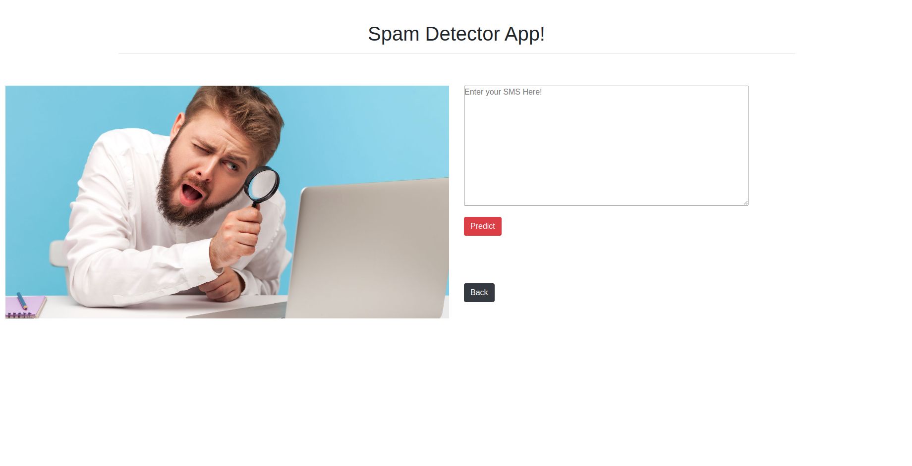

<h1 align='center'>Search.Ai</h1>

# Hi guys 👋, This project consist of different AI projects, using Machine Learning and Deep Learning (Number Detection, Image Classifier, House Price Prediction, Restaurant Review, Spam Detector ).

## **Applications**

- ### **Number Detector**

   
   

- ### **Image Classifier**

   
   

- ### **House Price**

   
   

- ### **Restaurant Review**

   
   

- ### **Spam Detector**

   
   

## Installation

- Visual Studio, Atom, PyCharm, Jupyter Notebook
- Python
- Flask
- Numpy
- Pandas
- Matplotlib
- Seaborn
- Sklearn
- Xgboos
- Joblib
- Pickle
- Tensorflow
- TFJS
- NLTK
- cv2

------------------------------------------------------------------------
------------------------------------------------------------------------
This repository was created by:  
- [Fraidoon Omarzai](https://www.linkedin.com/in/fraidoon-omarzai-8592131b4/)
------------------------------------------------------------------------
------------------------------------------------------------------------